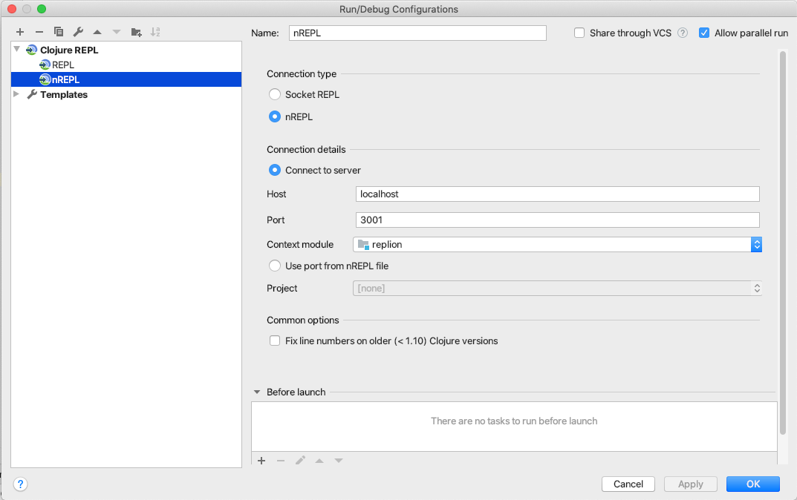

# replion

The REPL + Datomic ions

Datomic and Datomic Ions are a powerful database and platform for creating cloud applications. However, ions suffer from the same challenge as other cloud-based technologies - [temporal distance](https://youtu.be/jh4hMAvygjk). Simply stated, the biggest pain point with ions is the waiting around you do for your changes to be deployed. This is compounded in early-stage development when you are prone to making mistakes due to your lack of familiarity with the architecture, APIs, and so on. This results in most of your time spent pushing and deploying rather than coding. This is extremely frustrating and counter-productive.

What if, instead, you could deploy a simple, working system to the cloud and then securely REPL in to your system, develop as if you were on your local system, and then complete the push and deploy cycle after you've figured out all of the painful aspects of your initial product? 

This is the goal of replion, to give you step-by-step instructions and examples of how to do configure your Datomic system for cloud-based REPL development.

Note that for the entirety of this project I will use my stack/application name, "replion." You will use your stack/application name instead.

These instructions are for connecting a REPL to a solo instance of Datomic Cloud. Since I don't have the budget to spin up a prod instance on my own time to figure this out I'll leave prod instance configuration as an exercise for the reader unless someone wants to provide a prod system to me.

## Recommended Prereading
While not required, I strongly recommend understanding the basics of Datomic Cloud and Datomic Ions by going through the [Datomic Tutorial](https://docs.datomic.com/cloud/tutorial/client.html) and the [Datomic Ions Tutorial](https://docs.datomic.com/cloud/ions/ions-tutorial.html), including cloning, running, and carefully inspecting the [ion starter repo](https://github.com/datomic/ion-starter).

If you are already familiar with Datomic Cloud and Ions, feel free to move on to the next section.

## Enabling the REPL
The next sections will describe changes needed to your system to enable REPL connectivity.

Prior to any of the following steps, set up a Datomic Solo instance _exactly_ as described [here](https://docs.datomic.com/cloud/setting-up.html). This includes setting up the bastion for SSH access as described [here](https://docs.datomic.com/cloud/getting-started/configure-access.html#authorize-gateway).

### System Modifications
 1. Once you create your system, go to the [EC2 console](https://console.aws.amazon.com/ec2/v2/home?#Instances:sort=desc:instanceId) and view your system instances.
 1. Select the _compute_ instance from the instance list (e.g. replion) and then in the window below click on the security group link.
 1. Add 3 entries to the security group's inbound rules that are the same as the existing 3 rules except you want to set the port range to your REPL port. For example, if I were to use port 3001 for my REPL, I'd enter 3001 for the port range. My dialog is shown below.


### Code Modifications
You now need to modify your code to host an nrepl server. If you are using this project as your template the changes are already in place.
 1. Add `nrepl {:mvn/version "0.6.0"}` to the :deps map in your deps.edn file.
 1. In _a namespace that will be loaded by your Datomic system_, make the following changes:
    1. Add `[nrepl.server :refer [start-server]]` to your requires.
    1. Add `(defonce server (start-server :bind "0.0.0.0" :port 3001))` in your ns. Note that these options can vary if you wish.
 1. For reference, here is where I make these changes in this project and when I modified the Datomic/ion-starter project:
    1. In this project, I put these changes in the `replion.core` ns.
    1. If you are modifying the ion-starter project, I'd put the server definition right [here](https://github.com/Datomic/ion-starter/blob/master/src/datomic/ion/starter.clj#L11) and the requires in the usual place.
 1. Complete a push/deploy cycle to get your changes into your Datomic system.

Note that to ensure that your repl server is started, it must be in a ns that Datomic will load. Any ns that is referenced directly or indirectly by your lambdas in your ion-config.edn file will meet this requirement.

### Set up SSH tunnel through your bastion
You are now ready to connect to your system's REPL server. Do the following:
 1. From the EC2 instances panel, select your bastion (e.g. replion-bastion). Click the connect button. It will provide an example ssh connection string. Copy this down. It will be something along the lines of `ssh -i "keyname.pem" root@ec2-1-2-3-4.compute-1.amazonaws.com`.
 1. Select your compute instance (e.g. replion) and note its private ip as listed in the Description tab below the instance list. 
 1. Using the above two items, construct a connection command like so: `ssh -i ~/.ssh/$(yourkey).pem -L 3001:$(replion-private-ip):3001 ec2-user@$(public dns)`. The params `yourkey` and `public dns` will be from the first bullet and `replion-private-ip` will be from the second. Assuming the connection string shown above and a private ip of 4.3.2.1 your connection command will be `ssh -i ~/.ssh/keyname.pem -L 3001:4.3.2.1:3001 ec2-user@ec2-1-2-3-4.compute-1.amazonaws.com`.
 1. Execute this command in your project's terminal.

### Make the REPL connection
 1. From your favorite IDE, set up a remote REPL connection to localhost:3001. An example using Cursive is shown below.
 1. Connect!



### Details/Notes
You now have two ways to connect to your Datomic system:
 1. Using the standard socks proxy method as documented by Cognitect. This runs your code locally with a direct connection to your Datomic instance.
 1. Using a directly connected REPL. Your code is local, but you are running on your deployed instance. If you use this method, you do not need to run the socks proxy script or the datomic-access script. Just run the above ssh command to enable port forwarding.

## Time to Feel the Power!
Now that you've done all this, it's time to do something awesome with it. One challenge I face whenever learning APIs such as this is learning the little details of things like the correct form of function arguments. Am I given a map or a string containing a map? Are the keys strings or keywords? Json or edn? What keys are present? If I must do a different deploy and check every time I am working through each of these issues it can be a total time-suck. Let's see how our replion instance can help with this problem.

First, let's execute an existing lambda.

If you are using this project as your code, you can invoke the "hello" lambda like so:

`aws lambda invoke --function-name repl-ion-$(Group Name)-hello  --payload '' /dev/stdout`

You'll need to provide the correct Group Name parameter.

Now, it's time to leverage the awesome. Navigate to the replion.lambdas ns and view the code:

``` 
(ns replion.lambdas
  (:require [replion.core :as core]))

(defn hello [_] "{\"hello\":\"world\"}")
```

Now, change the body of the hello function so that we can get some useful information about what a basic lambda argument looks like:

```
(ns replion.lambdas
  (:require [replion.core :as core]
            [clojure.pprint :as pp]))

;Change your lambda to look like this. Also be sure to add the pprint require.
(defn hello [args]
  (format
    "{\"args\":%s}"
    (with-out-str (pp/pprint args))))
```

Reload this ns into your REPL. You should see something like this in your REPL output: "Loading src/replion/lambdas.clj... done"

Now, invoke the lambda again using the same line as above.

`aws lambda invoke --function-name repl-ion-$(Group Name)-hello  --payload '' /dev/stdout`

You should now see something like this:

```
{"args":{:context
 {:clientContext nil,
  :identity {:identityId "", :identityPoolId ""},
  :functionVersion "$LATEST",
  :memoryLimitInMB 256,
  :invokedFunctionArn
  "arn:aws:lambda:us-east-1:XXXXXXXXXXXX:function:repl-ion-Compute-AWESOMEGROUP-hello",
  :logGroupName "/aws/lambda/repl-ion-Compute-AWESOMEGROUP-hello",
  :logStreamName
  "2019/12/05/[$LATEST]...",
  :awsRequestId "...",
  :functionName "repl-ion-Compute-AWESOMEGROUP-hello",
  :remainingTimeInMillis 59924},
 :input "{}"}
}
```

If your mind wasn't just blown by what happened then you aren't paying attention. This is amazing. We just changed the body of a lambda with no long cycle deployment! Gone are the days of waiting around trying to figure out what's going on. Just connect and develop!

If you want to "commit" this version of the hello lambda, just do a "slow deploy" cycle (i.e. push then deploy as usual).

### Suggested Workflow
Now that we've done all this, I would suggest the following workflow for maximum productivity:
 1. Stand up a _minimal_ system whenever you are greenfielding a project.
 1. Either stub out all of your ions (modification required to `resources/datomic/ion-config.edn` and the appropriate ns) or just create a single 'Work in progress' ion. Deploy these ions.
 1. Using the REPL, develop against the above stubs or WIP until you like what you've got.
 1. Do a "slow deploy" (i.e. push & deploy).
 
As needed, whenever your dependencies change (e.g. you need to add another library) you will also need to do a slow deploy. Tip: Add the dependencies first without doing any coding with them, then add your logic at the REPL. I've encountered conflicts with jar versions when doing a deploy with code changes and these are difficult to debug. Instead, minimize the changes to the deployment cycle by first pushing the deps changes, making the code changes (in the REPL, so it works), and then pushing the code changes.

## TODOs
This is a work in progress, but is very powerful already. Some additional things I would like to do or see done:

 * Add web endpoint example.
 * Streamline the creation of the API gateway endpoints. If the one-lambda model were used then perhaps this would minimize the moving parts such that it would be feasible to just create one preconfigured endpoint per system automatically.
 * Get an example of this working on all deployment topologies.

## Suggestions for the Datomic Team
These are a few ideas that the Datomic Team might want to consider for future development. Datomic is, of course, their product and not mine so they can do whatever they want with these suggestions.

 * Add a startup/init ns or hook along the lines of integrant init. This would enable control of stateful items such as connections as well as provide a more solid mount point for starting the nrepl server and so on.
 * If the above ideas are good ones, consider adding port fowarding over the bastion as a default option. Perhaps setting the port as a configuration option in the CloudFormation template. This would also necessitate ensuring the concept works for other topologies as well.

## License

Copyright © 2019 Mark Bastian

This program and the accompanying materials are made available under the
terms of the Eclipse Public License 2.0 which is available at
http://www.eclipse.org/legal/epl-2.0.

This Source Code may also be made available under the following Secondary
Licenses when the conditions for such availability set forth in the Eclipse
Public License, v. 2.0 are satisfied: GNU General Public License as published by
the Free Software Foundation, either version 2 of the License, or (at your
option) any later version, with the GNU Classpath Exception which is available
at https://www.gnu.org/software/classpath/license.html.
