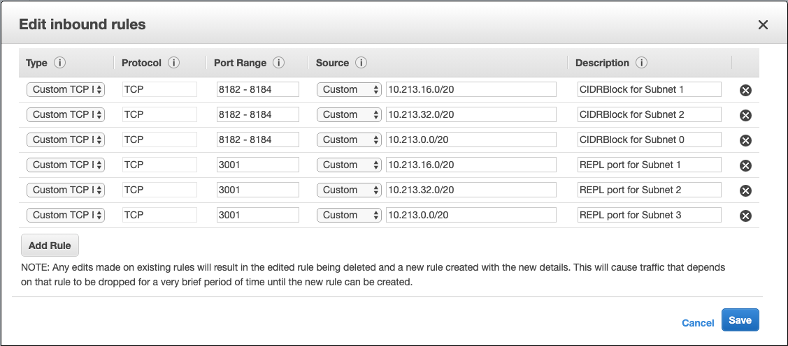

# replion

The REPL + Datomic ions

Datomic and Datomic Ions are a powerful database and platform for creating cloud applications. However, ions suffer from the same challenge as other cloud-based technologies - [temporal distance](https://youtu.be/jh4hMAvygjk). Simply stated, the biggest pain point with ions is the waiting around you do for your changes to be deployed. This is compounded in early-stage development when you are prone to making mistakes due to your lack of familiarity with the architecture, APIs, and so on. This results in most of your time spent pushing and deploying rather than coding. This is extremely frustrating and counter-productive.

What if, instead, you could deploy a simple, working system to the cloud and then securely REPL in to your system, develop as if you were on your local system, and then complete the push and deploy cycle after you've figured out all of the painful aspects of your initial product? 

This is the goal of replion, to give you step-by-step instructions and examples of how to do configure your Datomic system for cloud-based REPL development.

Note that for the entirety of this project I will use my stack/application name, "replion." You will use your stack/application name instead.

These instructions are for connecting a REPL to a solo instance of Datomic Cloud. Since I don't have the budget to spin up a prod instance on my own time to figure this out I'll leave configuration as an exercise for the reader unless someone wants to provide a prod system to me.

## Recommended Prereading
While not required, I strongly recommend understanding the basics of Datomic Cloud and Datomic Ions by going through the [Datomic Tutorial](https://docs.datomic.com/cloud/tutorial/client.html) and the [Datomic Ions Tutorial](https://docs.datomic.com/cloud/ions/ions-tutorial.html), including cloning, running, and carefully inspecting the [ion starter repo](https://github.com/datomic/ion-starter).

If you are already familiar with Datomic Cloud and Ions, feel free to move on to the next section.

## Enabling the REPL
The next sections will describe changes needed to your system to enable REPL connectivity.

Prior to any of the following steps, set up a Datomic Solo instance _exactly_ as described [here](https://docs.datomic.com/cloud/setting-up.html). This includes setting up the bastion for SSH access as described [here](https://docs.datomic.com/cloud/getting-started/configure-access.html#authorize-gateway).

### System Modifications
1. Once you create your system, go to the [EC2 console](https://console.aws.amazon.com/ec2/v2/home?#Instances:sort=desc:instanceId) and view your system instances.
1. Select the _compute_ instance from the instance list (e.g. replion) and then in the window below click on the security group link.
1. Add 3 entries to the security group's inbound rules that are the same as the existing 3 rules except you want to set the port range to your REPL port. For example, if I were to use port 3001 for my REPL, I'd enter 3001 for the port range. My dialog is shown below.

### Code Modifications
You now need to modify your code to host an nrepl server.

1. Add `nrepl {:mvn/version "0.6.0"}` to the :deps map in your deps.edn file.
1. In your `main` namespace (this is up to you), make the following changes:
   1. Add `[nrepl.server :refer [start-server]]` to your requires.
   1. Add `(defonce server (start-server :bind "0.0.0.0" :port 3001))` in your ns. Note that these options can vary if you wish.
1. For reference, here is where I make these changes in this project and when I modified the Datomic/ion-starter project:
   1. In this project, I put these changes in the `replion.core` ns.
   1. If you are modifying the ion-starter project, I'd put the server definition right [here](https://github.com/Datomic/ion-starter/blob/master/src/datomic/ion/starter.clj#L11) and the requires in the usual place.
1. Complete a push/deploy cycle to get your changes into your Datomic system.

### Set up SSH tunnel through your bastion
You are now ready to connect to your system's REPL server. Do the following:
1. From the EC2 instances panel, select your bastion (e.g. replion-bastion). Click the connect button. It will provide an example ssh connection string. Copy this down. It will be something along the lines of `ssh -i "keyname.pem" root@public-dns.compute-1.amazonaws.com`.
1. Select your compute instance (e.g. replion) and note its private ip as listed in the Description tab below the instance list. 
1. Using the above two items, construct a connection command like so: `ssh -i ~/.ssh/$(yourkey).pem -L 3001:$(replion-private-ip):3001 ec2-user@$(public dns)`. The params `yourkey` and `public dns` will be from the first bullet and `replion-private-ip` will be from the second.
1. Execute this command in your project's terminal.

### Make the REPL connection

## License

Copyright © 2019 Mark Bastian

This program and the accompanying materials are made available under the
terms of the Eclipse Public License 2.0 which is available at
http://www.eclipse.org/legal/epl-2.0.

This Source Code may also be made available under the following Secondary
Licenses when the conditions for such availability set forth in the Eclipse
Public License, v. 2.0 are satisfied: GNU General Public License as published by
the Free Software Foundation, either version 2 of the License, or (at your
option) any later version, with the GNU Classpath Exception which is available
at https://www.gnu.org/software/classpath/license.html.
